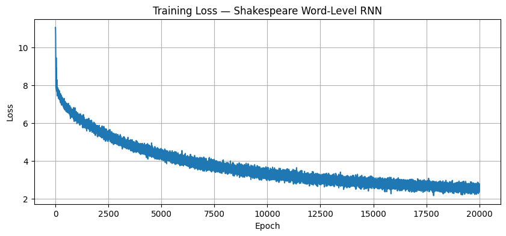

# Shakespeare Text Generation — Word-Level RNN

A PyTorch implementation of a word-level RNN trained on Shakespeare's complete works to generate Shakespeare-style text.

## Model Architecture

- Embedding layer (vocab → 256-dim vectors)
- Single-layer RNN (hidden size: 256)
- Linear projection (hidden → vocab size)

## Training

- Dataset: Shakespeare's complete works (~800K words, ~25K unique vocabulary)
- Epochs: 20,000
- Optimizer: Adam (lr=0.001)
- Loss: Cross-Entropy
- Final loss: ~2.3

## Training Loss

## Sample Output
